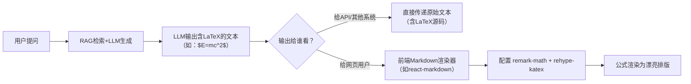

## 一、子功能区简介

##### 目标：辅助智能体的本地知识库也就是RAG功能。用户可以在这里和结合了专用知识库的LLM交流，思考方法，形成一个初步的建模思路，或者得到自己想要的内容。

##### 核心功能：可以把这里的建模思路加载到任务智能体里面，控制引导智能体进行建模，智能体每次任务完成也可以由用户选择是否将这次任务的报告文档放入知识库

## 二、功能模块原型设计

## 三、检索整体流程

                     用户题目
                       ↓
             ┌───────────────────┐
             │ Hybrid Retrieval  │
             │                   │
             │ Dense        BM25 │
             │   ↓            ↓  │
             │ Top 50      Top 50│
             └─────────┬─────────┘
                       ↓
                      RRF
                       ↓
                     Top 5
                       ↓
                  Compression
                       ↓
                      LLM

## 四、技术细节

#### chunk

    基于LlamaIndex的SentenceWindowNodeParser

#### 嵌入模型

    BGE-Small-Zh-V1.5

#### 向量数据库

    Qdrant

#### 检索策略

    🔧 第一阶段：检索前（Query 预处理）
        目标：让“用户的问题”变得更容易被向量库匹配。

        1. 查询改写/拓展：
        - 用HyDE（假设性文档嵌入）：让 LLM 根据用户问题生成一个“假想的完美答案文档”，然后用这个假文档的向量去检索。
        - 使用llamaindex 的HyDEQueryTransform、TransformQueryEngine 来实现。
        - LLM使用当前建模任务中接入的API模型；编码使用现有的 BGE-Small-Zh-V1.5。

    ⚙️ 第二阶段：检索中（核心召回）
        目标：从向量库里检索出最可能相关的候选文档块。

        1. 并行执行混合检索（Hybrid Search）：
        - 同时跑稀疏向量（BM25）和 密集向量（语义嵌入）。
        2. 初步召回：这一步会拿回较多的结果，这里取top50,为后面的精排做准备。

    🧹 第三阶段：检索后（结果精炼）
        目标：把粗召回的结果做“提纯”，喂给大模型之前去除噪音。

        1. 上下文压缩（Compression）：
        - 使用LangChain的ContextualCompressionRetriever组件来实现上下文压缩，使用LLMChainFilter来过滤冗余信息。

## 五、前端渲染

流程图：

### ⚙️ 具体怎么做

#### 第1步：让LLM输出标准LaTeX

这是所有工作的基础。你需要在Prompt中**明确要求**LLM使用LaTeX语法书写公式。

*   **行内公式**：用 `$...$` 包裹，例如 `$E=mc^2$`。
*   **块级公式**：用 `$$...$$` 包裹，例如 `$$\int_a^b f(x) dx$$`。

**Prompt 示例**:
> “请用自然语言回答我的问题。如果回答中涉及数学公式，**必须使用 LaTeX 语法**，行内公式用 `$...$` 包裹，块级公式用 `$$...$$` 包裹。不要使用其他格式。”

#### 第2步：前端渲染（针对Web应用）

**LLM输出什么，前端就展示什么，但展示前先“渲染”一下**。

以React为例，技术栈是 `react-markdown` + `remark-math` + `rehype-katex`：

