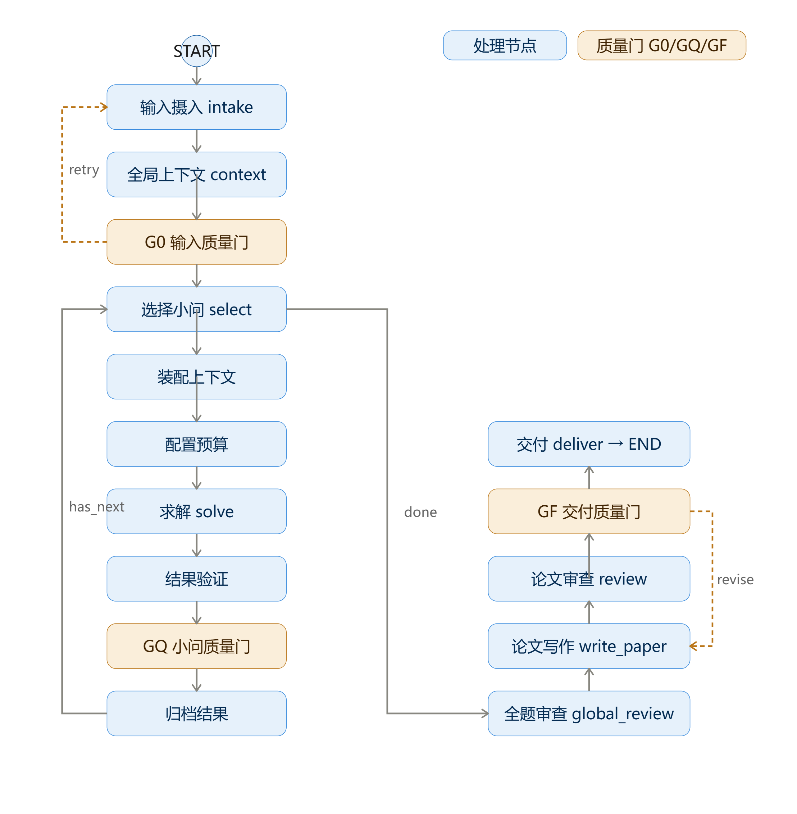

# 建模智能体系统架构

> 文档定位：定义一个**面向问题的通用建模智能体**。
>
> 只要用户提供问题文档和附件数据，系统就能读懂问题、选择方法、完成计算、验证结果，并交付建模报告。适用场景不限：竞赛赛题、课程作业、科研问题、业务分析均可。
>
> 核心范式：**先建立全局上下文，再按小问顺序完成"理解 - 选法 - 计算 - 验证 - 沉淀"闭环，最后统一审查与写作。**

---

## 1. 目标与边界

### 1.1 系统目标

系统的目标不是自动堆砌复杂模型，而是把一个问题组织成逻辑完整、计算可信、可解释且可复现的建模方案。

1. **先读懂问题和数据**：问题背景、约束、附件结构与数据质量必须在建模前明确。
2. **按小问递进求解**：问题拆分为小问后按依赖顺序推进，后问选择性复用前问成果。
3. **方法选择有依据**：针对当前小问搜索和比较候选方法，不因"模型先进"而采用。
4. **数值结果可复现**：最终数值、图表和表格由确定性代码生成，不能由 LLM 编造。
5. **每问可独立写作**：每道小问结束时生成可直接进入报告的结果包。
6. **最终交付可审计**：结论能追溯到数据、公式、代码、图表和引用来源。

### 1.2 非目标

- 不要求每道题都使用复杂模型或联网检索；简单、稳健、可解释的方法优先。
- 不将所有小问并行求解；存在依赖时必须按顺序推进。
- 不把搜索结果直接当作结论或模型决策依据。
- 不在写作阶段重新计算或修改已验证的数值。

---

## 2. 总体工作流

```text
输入问题与附件
      |
      v
输入摄入：文件读取、数据画像
      |
      v
建立全局上下文：小问列表、依赖关系、问题-数据映射  ── G0 输入质量门
      |
      v
按顺序处理当前小问 -------------------------------------+
      |                                                  |
      v                                                  |
装配上下文 -> 问题澄清 -> 方法探索 -> 方法决策             |
      |                                                  |
      v                                                  |
建模计算 <-> 结果验证 <-> 必要时迭代  ── GQ 小问质量门     |
      |                                                  |
      v                                                  |
生成本问结果包 -> 提炼可复用摘要 -> 下一小问 -------------+
      |
      v
全题审查 -> 报告写作 -> 格式与内容审查  ── GF 交付质量门
      |
      v
最终交付
```



系统由一个**项目编排器**（LangGraph 主图）驱动。它不直接负责数学推理，而是维护项目状态、选择下一步、控制重试边界、保存产物并调度各功能模块。

---

## 3. 项目结构

```text
MMAgent/
├── scr/                        # 核心引擎（LangGraph 状态图）
│   ├── math_modeling_agent/    # 入口：main.py(CLI) / graph.py(主图) / state.py(状态) / llm.py(LLM 工厂)
│   ├── workflow/               # 工作流节点：intake(摄入) / project_context(上下文) / question_loop(逐问循环)
│   ├── agents/                 # 结构化推理：problem_analyst / method_explorer / model_builder /
│   │                           #   question_solver / result_validator / paper_writer / reviewer / ...
│   ├── gates/                  # 质量门：g0_intake / gq_question / gf_delivery
│   ├── schemas/                # Pydantic 数据契约（全部状态与 LLM 输出）
│   ├── tools/                  # 确定性工具：文件读取 / 代码执行 / 可视化 / 表格 / 搜索 / DOCX 转换
│   ├── runtime/                # 运行时：产物 / 检查点 / 预算 / 日志
│   ├── prompts/                # LLM 提示词模板
│   └── templates/              # 报告模板
│
├── server/                     # 服务层：FastAPI + SQLite，任务提交 / 异步执行 / 进度回写 / 产物托管
├── web/                        # 前端：React + Vite，新建任务 / 进度跟踪 / 结果查看 / 历史管理
│
├── tests/                      # 单元测试
├── examples/                   # 样例问题与附件
└── artifacts/                  # 每次运行的产物，按 run_id 隔离
```

职责边界（比模块数量更重要）：

- `workflow/` 只负责流程流转，不做推理；
- `agents/` 只负责结构化推理（LLM），不直接读写文件、不生成最终数值；
- `tools/` 只负责确定性计算与文件操作；
- `schemas/` 定义一切跨模块数据契约。

---

## 4. 核心状态

状态采用"全局只读上下文 + 当前小问可写状态 + 已完成结果库"的三区分法，后续小问能获得必要信息，又不会被历史细节淹没。

| 分区             | 内容                                                                                      | 读写规则                     |
| ---------------- | ----------------------------------------------------------------------------------------- | ---------------------------- |
| 全局只读上下文   | `ProjectContext`（背景/目标/约束/小问/依赖/问题-数据映射）、`DataProfile`（数据画像） | 摄入阶段生成后只读           |
| 当前小问可写状态 | `CurrentQuestionContext`（本问输入包）、`QuestionResult`（本问结果包）                | 求解时写入，验证后归档       |
| 已完成结果库     | `question_results`（各问验证后的结果包）                                                | 后续小问和报告的唯一可信输入 |

辅助库：`EvidenceCatalog`（检索证据与引用）、`ArtifactRegistry`（产物登记）、`DecisionLog`（决策理由）、`RunLedger`（步骤耗时与错误）。

状态原则：**LLM 只写结构化推理、方案和解释；数据表、代码运行输出和图片仅以文件路径或产物 ID 引用。**

---

## 5. 各环节职责

### 5.1 输入摄入（确定性，无 LLM）

- 提取问题全文与附件清单，读取 CSV / Excel / JSON / Markdown 等文件；Excel 必须遍历全部工作簿与 Sheet。
- 由确定性工具生成数据画像：行列数、字段类型、描述统计、缺失率、时间维度、单位线索、表间关联与质量问题。
- 原始输入登记为只读产物，后续预处理不得覆盖原文件。
- **画像直接约束方法选择**：无时间维度不得选时间序列模型；样本量过小不得将高参数模型作为主模型；只有排序指标不得宣称因果关系。

### 5.2 全局上下文建立（LLM 推理）

- 问题理解：研究对象、背景机制、显式与隐式约束、每问目标、预期输出、术语与歧义点。此阶段不推荐模型。
- 小问拆分与依赖识别：依赖图必须无环；天然递进的题目默认 `Q(n)` 依赖 `Q(n-1)`。
- 生成问题-数据映射表：每问对应的目标、所需数据、前置成果与预期输出。
- **G0 输入质量门**：小问提取完整、附件全部读取或明确标记不可读、依赖无环、关键数据缺口已记录。失败只重跑摄入；题意存在无法消除的歧义则请求人工澄清，不伪造假设继续。

### 5.3 逐问求解闭环（主循环）

每个小问依次执行：

1. **装配上下文**：当前小问原文与目标 + 相关全局约束 + 所需数据质量信息 + 前问的 `reusable_summary`（选择性继承：只继承结论、可复用数据、模型接口与限制，不传中间推理和失败尝试）。
2. **问题澄清**：确定数学任务类型（评价/预测/优化/分类/聚类/仿真/机理或组合）、决策变量、目标函数、约束、必要假设，以及与前问的关系（继承/比较/改进/独立）。
3. **方法探索**：从题型规则提出基础候选，对未知点联网检索；为每种候选建立证据卡（适用条件、数据要求、优缺点、验证方式、来源与局限）；保留至少一个简单基线。
4. **方法决策**：按题意匹配、数据匹配、假设合理性、可验证性、可解释性、实现成本、递进价值比较候选；输出"主方法 + 基线 + 选择理由 + 放弃理由 + 验证计划"。数据不满足或假设不成立的方案直接淘汰。
5. **建模计算**：输出规范化的模型表述（假设、符号、变量、目标、约束、推导、参数），随后调用确定性工具或生成代码在沙箱执行。记录输入数据版本、代码路径、参数、随机种子、执行日志与结果文件。图表必须服务于结论，不做装饰性图表。
6. **结果验证**：按题型自动组合检查——评价类查权重扰动与排名稳定性；预测类查训练/测试误差、残差与时间泄漏；优化类查约束可行性、边界情形与参数敏感性；仿真类查种子复现与样本敏感性。通用检查还包括单位量级、数据泄漏、结论强度与题目约束覆盖。
7. **GQ 小问质量门**：回答完整、方法可解释、产物可复现、验证已完成、结论与局限已记录、已生成可复用摘要，方可标记 `validated` 归档。

**局部回退**：数据口径错误回到数据准备；计算错误修复当前任务；模型不适配回到方法决策；多次失败标记 `blocked` 并说明原因，不影响已完成小问。每类回退设预算（如方法重选 ≤2 次、代码修复 ≤3 次），预算耗尽产出风险说明，不伪造通过。

### 5.4 全题审查

所有小问完成后先审查再写作：小问结论是否覆盖问题要求；后问是否正确使用前问结果；数据口径、单位、符号、假设是否一致；关键数值能否定位到计算产物；验证是否充分；复杂模型相对基线是否有可解释增益。发现问题只回退到受影响的小问或章节，不重置整个项目。

### 5.5 报告写作

写作器只读取已验证的小问结果包、证据库和产物库，输出建模报告（Markdown + DOCX）：

```text
摘要（最后生成）
问题重述与问题分析
模型假设与符号说明
数据说明与预处理
各小问的模型建立、求解、结果和检验
模型评价、优缺点与推广
参考文献
附录：代码、补充表格与补充图
```

规则：每问对应完整的"问题 - 方法 - 结果 - 检验 - 结论"叙述；公式、图、表编号并在正文解释；外部事实必须来自证据库，数值必须来自计算产物；摘要最后生成且不引入新数字。报告可按具体场景（如竞赛论文）套用相应格式模板。

### 5.6 交付（GF 交付质量门）

通过条件：问题覆盖完整、图文表公式齐备、引用可追溯、所有数值可复现、格式符合目标模板、审查问题已关闭或显式接受风险。未通过时自动修订重写。

最终产物目录：

```text
artifacts/<run_id>/
  run.log                 # 结构化运行日志
  paper.md / paper.docx   # 建模报告
  review_report.json      # 审查报告
  input/                  # 原始问题与附件登记
  context/                # 数据画像、依赖图
  questions/<qid>/        # 每问的代码、数据、图表、结果包
  figures/                # 报告图表
```

---

## 6. 质量门

| 质量门     | 检查内容                                       | 失败处理                   |
| ---------- | ---------------------------------------------- | -------------------------- |
| G0（输入） | 小问完整、附件已读、依赖无环、数据缺口已记录   | 重跑摄入或请求人工介入     |
| GQ（小问） | 回答问题要求、计算可复现、验证完成、结论已记录 | 局部回退重试或标记 blocked |
| GF（交付） | 覆盖完整、图文表公式齐备、引用可追溯、格式合规 | 自动修订重写               |

---

## 7. 运行规范

- **可复现**：原始数据只读；随机过程记录种子与重复次数；每张图、每个表、每个关键数字可追溯到代码与数据版本；运行失败保留错误类型和日志。
- **检查点**：在 G0、每个 GQ、模型重选前、全题审查前及交付前保存检查点；恢复时跳过已验证的小问和已有的确定性产物。
- **预算与降级**：对检索次数、候选数量、修复次数、验证迭代、时间与令牌设预算；预算紧张时按"减少低价值候选 → 优先简单基线 → 减少非关键图表"降级，但不得跳过数据质量检查、数值复现和问题覆盖检查。
- **人工介入是例外**：仅在关键输入缺失、题意歧义无法消除、全部候选失效、关键假设无法验证或预算耗尽时触发。

---

## 8. 验收标准

系统在一个多小问、含多 Sheet Excel 附件的样例上运行时，应满足：

1. 完整列出所有文件、Sheet、字段和主要数据质量问题。
2. 提取全部小问并给出明确的依赖关系和问题-数据映射。
3. 按小问顺序运行，后问只接收必要的前问摘要。
4. 每问均保留方法选择理由、可运行代码、验证报告、图表和结论。
5. 某一问回退时，不无故重跑已验证的小问。
6. 最终报告的关键数值、图表、方法依据和参考文献均可追溯。
7. 无法验证或无法获得关键输入时，明确报告风险，而不是生成看似完整的虚假答案。
