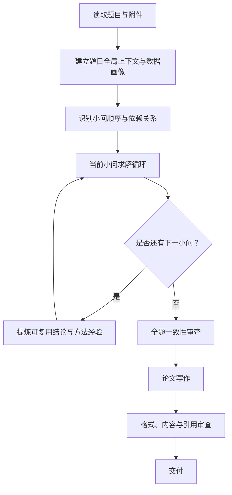

# 数学建模智能体系统架构

> 文档定位：定义一个面向数学建模竞赛的、可复现的智能体工作流。
>
> 核心范式：**先建立全局上下文，再按小问顺序完成“理解 - 选法 - 计算 - 验证 - 沉淀”闭环，最后统一审查与写作。**

---

## 1. 设计目标与边界

系统的目标不是自动堆砌复杂模型，而是在有限竞赛时间内，形成逻辑完整、计算可信、可解释且符合论文规范的解题方案。

### 1.1 设计目标

1. **先读懂题目和数据**：题目背景、约束、附件结构与数据质量必须在建模前明确。
2. **按小问递进求解**：题目小问按依赖关系顺序推进，后题选择性复用前题成果。
3. **方法选择有依据**：针对当前小问搜索和比较候选方法，不因“模型先进”而采用。
4. **数值结果可复现**：最终数值、图表和表格由确定性代码或工具生成，不能由 LLM 编造。
5. **每问可独立写作**：每道小问结束时生成可直接进入论文的结果包。
6. **最终交付可审计**：结论能追溯到数据、公式、代码、图表和引用来源。

### 1.2 非目标

- 不要求每道题都使用复杂模型或联网检索；简单、稳健、可解释的方法优先。
- 不将所有小问并行求解；存在依赖时必须按顺序推进。
- 不把搜索结果直接当作结论或模型决策依据。
- 不在写作阶段重新计算或修改已验证的数值。

---

## 2. 总体工作流

```text
输入题目与附件
      |
      v
项目初始化：文件读取、数据画像、题目理解
      |
      v
建立全局上下文：小问列表、依赖关系、题目-数据映射
      |
      v
按顺序处理当前小问 -------------------------------------+
      |                                                  |
      v                                                  |
理解要求 -> 装配上下文 -> 方法探索 -> 方法决策            |
      |                                                  |
      v                                                  |
建模计算 <-> 结果验证 <-> 必要时迭代                     |
      |                                                  |
      v                                                  |
生成本问结果包 -> 提炼可复用摘要 -> 下一小问 -------------+
      |
      v
全题审查 -> 论文写作 -> 格式与内容审查 -> 最终交付
```




系统由一个**项目编排器**驱动。它不直接负责数学推理，而是维护项目状态、选择下一步、控制重试边界、保存产物与调度各功能模块。

---

## 3. 核心对象与状态

状态采用“全局只读上下文 + 当前小问可写状态 + 已完成结果库”的分区方式。这样后续小问能获得必要信息，又不会被历史细节和无效尝试淹没。

### 3.1 项目全局上下文 `ProjectContext`

在读题阶段生成，后续只允许补充澄清，不应被单题求解器随意改写。

```python
class ProjectContext(TypedDict):
    run_id: str
    problem_text: str
    competition_requirements: dict
    background_summary: str
    objectives: list[str]
    constraints: list[str]
    terminology: dict[str, str]
    questions: list[dict]
    question_dependencies: dict[str, list[str]]
    question_data_map: dict[str, list[str]]
```

每个 `question` 至少包含：编号、原题文本、预期输出、题型、输入数据、前置问题和完成状态。依赖关系必须无环；若题目天然按顺序递进，则默认 `Q(n)` 依赖 `Q(n-1)`，但允许显式取消无意义依赖。

### 3.2 数据画像 `DataProfile`

数据画像必须由确定性工具生成。Excel 读取需要覆盖每个工作簿、每个 Sheet，而不是只读取第一个表。

```python
class DataProfile(TypedDict):
    files: list[dict]              # 文件类型、路径、大小、读取状态
    tables: list[dict]             # Sheet/表名、行列数、字段、样例
    fields: list[dict]             # 类型、单位线索、缺失率、取值范围
    relationships: list[dict]      # 表间关联键与置信度
    quality_issues: list[dict]     # 缺失、重复、异常、单位或口径风险
    preliminary_findings: list[str]
    artifacts: list[str]           # 画像报告、描述统计、初步图表路径
```

数据画像的作用是约束方法选择。例如：没有时间维度时不得选时间序列模型；样本量过小时不得将高参数模型作为主模型；只有排序指标时不能宣称因果关系。

### 3.3 小问结果包 `QuestionResult`

每个小问完成后写入结果库，并视为后续问题和论文的唯一可信输入。

```python
class QuestionResult(TypedDict):
    question_id: str
    status: str                   # pending / solving / validated / blocked
    problem_interpretation: dict
    inherited_context: dict
    method_candidates: list[dict]
    decision_record: dict
    assumptions: list[dict]
    formulation: dict
    data_preparation: dict
    computation: dict             # 代码、参数、随机种子、结果文件
    validation: dict
    findings: dict
    figures: list[str]
    tables: list[str]
    reusable_summary: dict
    limitations: list[str]
```

其中 `reusable_summary` 只保存后题确实可能需要的信息：已验证的结论、可复用数据集、模型接口、关键参数、限制和改进方向。它不是完整的思考记录。

### 3.4 证据与产物库

- `EvidenceCatalog`：联网检索或本地资料形成的来源、关键观点、适用条件、局限和引用信息。
- `ArtifactRegistry`：代码、处理后数据、图、表、报告、论文文件的逻辑名称与路径。
- `DecisionLog`：模型选择、重大假设、回退和人工干预的理由。
- `RunLedger`：步骤状态、耗时、工具调用、错误、重试次数和检查点。

状态原则：LLM 只写结构化推理、方案和解释；数据表、代码运行输出和图片仅以文件路径或产物 ID 引用。

---

## 4. 阶段一：输入、理解与全局规划

### 4.1 输入摄入

输入包括题目文档、比赛要求、附件和用户补充说明。系统应：

1. 提取题目全文、附件清单及格式。
2. 读取 CSV、Excel、JSON、Markdown 等常见文件；Excel 必须遍历全部 Sheet。
3. 对每张表生成字段定义、描述统计、缺失和异常报告。
4. 将原始输入复制或登记为只读产物，后续预处理不能覆盖原文件。

### 4.2 题目理解与小问拆分

题目理解器只负责回答“题目要求什么”，不在此阶段推荐模型。输出内容包括：研究对象、背景机制、显式与隐式约束、每问目标、输出形式、评分或评价口径、术语定义和歧义点。

随后建立小问依赖图，并生成题目-数据映射表：

| 小问 | 目标               | 需要的数据        | 前置成果      | 预期输出         |
| ---- | ------------------ | ----------------- | ------------- | ---------------- |
| Q1   | 例如：建立评价指标 | 指标表            | 无            | 权重、得分、排序 |
| Q2   | 例如：预测未来趋势 | 历史数据、Q1 指标 | Q1 的有效指标 | 预测结果与误差   |

### 4.3 输入质量门 `G0`

通过条件：题目小问已完整提取、附件均已读取或明确标记为不可读、每问有目标与预期输出、依赖关系无环、关键数据缺口已记录。

失败处理：只重跑题目解析或数据读取；若文件损坏、题干缺页或关键语义无法消除，则进入 `need_clarification`，不应伪造假设继续求解。

---

## 5. 阶段二：逐问求解闭环

逐问求解是系统的主循环。默认按题目顺序处理，但编排器可以依据依赖图跳过无依赖、已完成或被阻塞的小问。

### 5.1 上下文装配

当前小问的输入包由以下内容组成：

```text
CurrentQuestionContext =
  当前小问原文与目标
  + 相关的全局背景与约束
  + 所需数据及质量信息
  + 前置小问的 reusable_summary
  + 当前项目的时间、算力与工具预算
```

前置成果需经“选择性继承”判断：

- 前问结论是本问的输入或约束时，直接继承。
- 前问使用的方法可作为基线或候选改进方向时，继承其方法与局限。
- 前问数据处理能复用时，继承处理后的数据及其口径。
- 与本问无关的中间推理、失败尝试和冗长原始文本不传入。

### 5.2 问题澄清

当前小问先形成 `ProblemInterpretation`：

- 要解决的数学任务：评价、预测、优化、分类、聚类、仿真、机理解释或组合任务；
- 决策变量、目标函数、约束条件、评价指标与结果形式；
- 可用数据、缺失数据、必要假设和可接受的简化；
- 与前问的关系：继承、比较、改进、独立或反驳。

这一输出必须能使审查器判断“所建模型是否真正回答了该问”。

### 5.3 方法探索与证据收集

方法探索服务于当前小问，而不是形成独立的、全题一次性研究层。

1. 先从题型规则库提出基础候选：统计描述、回归、评价、规划、动态规划、网络、仿真、机器学习等。
2. 对领域知识、模型前提、参数范围、验证方式等未知点进行联网检索或本地资料检索。
3. 为每种可用方法建立证据卡：适用条件、所需数据、主要公式或算法、优缺点、可验证方式、来源和局限。
4. 保留至少一个简单基线方案，用于比较复杂模型的实际增益。

检索结果必须先进入 `EvidenceCatalog`，不能直接写入模型结论。模型原理、领域事实和关键阈值应标记来源；网络资料不足时，可以使用一般数学知识，但必须在决策记录中说明不确定性。

### 5.4 方法决策

候选方法按以下维度比较：

| 维度       | 判断问题                                       |
| ---------- | ---------------------------------------------- |
| 题意匹配   | 是否直接回答本问要求？                         |
| 数据匹配   | 字段、样本量、时间维度和质量是否支持？         |
| 假设合理性 | 核心假设是否能被题目或数据支撑？               |
| 可验证性   | 能否进行误差、敏感性、稳定性或约束检验？       |
| 可解释性   | 是否能给出竞赛论文需要的解释？                 |
| 实现成本   | 能否在预算内稳定求解并复现？                   |
| 递进价值   | 是否复用了前问成果，或在必要时作出了合理改进？ |

决策输出为“主方法 + 基线或备用方法 + 选择理由 + 放弃理由 + 验证计划”。默认不要求人工确认；只有关键假设无法验证、候选方法都不满足条件、或多次验证失败时，才请求人工介入。

### 5.5 建模、计算与可视化

求解器输出规范化的建模说明：假设、符号表、变量、目标、约束、公式推导、算法步骤和参数设置。随后调用确定性工具或代码完成计算。

计算运行必须记录：输入数据版本、代码路径、依赖版本、参数、随机种子、执行日志、结果表和图片路径。随机模型应固定种子，并在必要时进行多次重复实验。

图表应服务于结论，例如：描述数据分布、展示拟合或残差、比较方案、说明优化结果、展示敏感性。不能只生成装饰性图表。

### 5.6 结果验证与迭代

验证器根据题型自动组合检查项：

| 题型      | 至少包含的验证                                       |
| --------- | ---------------------------------------------------- |
| 评价/排序 | 指标方向、权重和、排名稳定性、权重扰动或替代方法比较 |
| 预测/回归 | 训练与测试误差、残差、基线比较、时间泄漏检查         |
| 优化/规划 | 约束可行性、目标值、边界情形、参数扰动、可行解解释   |
| 分类/聚类 | 指标、样本划分、稳定性、类别或簇的业务解释           |
| 仿真/机理 | 量纲、边界条件、重复试验、参数敏感性、现实合理性     |

通用检查还包括：单位和量级是否合理、数据是否泄漏、结论是否超出模型能力、是否满足题目所有约束、结果能否复跑。

验证失败时按问题类型局部回退：

- 数据口径或预处理错误：回到当前小问的数据准备。
- 代码、求解或收敛错误：修复当前计算任务。
- 假设或模型不适配：回到方法决策，保留可复用的证据和数据。
- 当前小问多次失败：标记为 `blocked`，说明原因并请求人工选择，不影响已完成小问。

每类回退应设预算，例如方法重选不超过 2 次、代码修复不超过 3 次、验证迭代不超过 2 次。预算耗尽不是“伪造通过”，而是产出风险说明。

### 5.7 小问结果门 `GQ`

一个小问只有在以下条件满足后才能写入 `validated`：

- 回答了题目要求，且输出形式完整；
- 主方法、假设、关键参数和计算过程可解释；
- 数值、图表和表格均有可复现产物；
- 完成与题型相符的验证；
- 结论与局限均已记录；
- 已生成可供后续小问使用的 `reusable_summary`。

---

## 6. 阶段三：全题审查、论文与交付

### 6.1 全题一致性审查

完成所有小问后，先审查再写作。审查器检查：

1. 所有小问是否都有结论，且结论覆盖题目要求。
2. 后题是否正确使用了前题结果；若没有使用，是否说明了原因。
3. 数据口径、单位、符号、假设、时间范围和实验设置是否一致。
4. 所有关键数值、图表和表格能否定位到计算产物。
5. 各模型的验证是否充分，结论强度是否与证据一致。
6. 复杂模型是否相对基线带来了可解释的增益。

发现问题只回退到受影响的小问或论文章节，不能重置整个项目。

### 6.2 论文写作

论文写作器只读取已验证的小问结果包、证据库和产物库。推荐章节顺序为：

```text
摘要（最后生成）
问题重述与问题分析
模型假设与符号说明
数据说明与预处理
各小问的模型建立、求解、结果和检验
模型评价、优缺点与推广
参考文献
附录：代码、补充表格与补充图
```

写作规则：

- 每一个小问必须对应完整的“问题 - 方法 - 结果 - 检验 - 结论”叙述。
- 公式、图、表必须编号并在正文解释。
- 外部事实和方法依据必须来自 `EvidenceCatalog`；计算数值必须来自 `QuestionResult.computation`。
- 摘要最后生成，包含问题类型、主要方法、关键结果和结论，不引入新数字。

### 6.3 交付质量门 `GF`

最终通过条件：题目覆盖完整、图文表公式齐备、引用可追溯、所有数值可复现、格式符合竞赛模板、审查问题已关闭或显式接受风险。

最终交付目录建议为：

```text
artifacts/<run_id>/
  input/                 # 原始题目与附件登记
  context/               # 题目理解、数据画像、依赖图
  questions/Q1/          # 每问的代码、数据、图表、结果包
  questions/Q2/
  evidence/              # 检索来源与引用库
  paper/                 # 草稿、终稿、参考文献
  review/                # 全题与格式审查报告
  final/                 # 最终论文、代码、图表、提交清单
```

---

## 7. 功能模块与职责

| 模块             | 职责                                   | 核心输出             |
| ---------------- | -------------------------------------- | -------------------- |
| 项目编排器       | 维护状态、依赖顺序、预算、检查点与路由 | 下一步任务、运行账本 |
| 输入与数据分析器 | 读取文档与所有附件，生成数据画像       | `DataProfile`      |
| 题目理解器       | 提取背景、约束、小问与数据映射         | `ProjectContext`   |
| 小问求解器       | 执行当前小问的理解、选法、计算和沉淀   | `QuestionResult`   |
| 方法研究器       | 为当前小问建立候选方法和证据卡         | `EvidenceCatalog`  |
| 确定性工具集     | 数据处理、求解、统计、作图和验证       | 代码运行产物         |
| 验证器           | 执行题型匹配的数值与逻辑验证           | `validation` 报告  |
| 论文写作器       | 基于已验证结果包组织论文               | 论文草稿与引用       |
| 审查器           | 检查全题逻辑、可复现性和格式           | 审查报告与修改任务   |

这些模块可以作为独立 Agent 实现，也可以在 MVP 阶段由一个编排图中的不同节点实现。关键是职责与状态边界清楚，而不是 Agent 数量多。

---

## 8. 运行规范

### 8.1 可复现性

- 原始数据只读，所有处理步骤保留配置和输出。
- 计算使用确定性工具；随机过程记录随机种子、抽样方式与重复次数。
- 每张图、每个表、每个关键数字均能追溯到对应代码与数据版本。
- 运行失败必须保留错误类型和日志，不能用文字掩盖失败。

### 8.2 检查点与恢复

在 `G0`、每个 `GQ`、模型重选前、全题审查前及交付前保存检查点。恢复时应跳过已验证的小问和已有的确定性产物，除非其上游数据或决策发生变化。

### 8.3 预算与降级

预算包括联网检索次数、方法候选数量、代码修复次数、验证迭代次数、时间和令牌。预算紧张时的降级顺序为：减少低价值候选、优先简单基线、减少非关键图表、保留必要验证；不得跳过数据质量检查、数值复现和题目覆盖检查。

### 8.4 人工介入

人工介入是例外，不是每题的必经流程。触发条件包括：关键输入缺失、题意存在无法消除的歧义、全部候选模型不满足基本条件、关键假设无法验证、迭代预算耗尽或终稿需要人工确认。

---

## 9. 架构验收标准

系统在一个多小问、含多 Sheet Excel 附件的样例上运行时，应满足：

1. 能完整列出所有文件、Sheet、字段和主要数据质量问题。
2. 能提取全部小问并给出明确的依赖关系和题目-数据映射。
3. 按小问顺序运行，后题只接收必要的前题摘要。
4. 每问均保留方法选择理由、可运行代码、验证报告、图表和结论。
5. 某一问回退时，不会无故重跑已验证的小问。
6. 最终论文的关键数值、图表、方法依据和参考文献均可追溯。
7. 在无法验证或无法获得关键输入时，系统明确报告风险，而不是生成看似完整的虚假答案。
