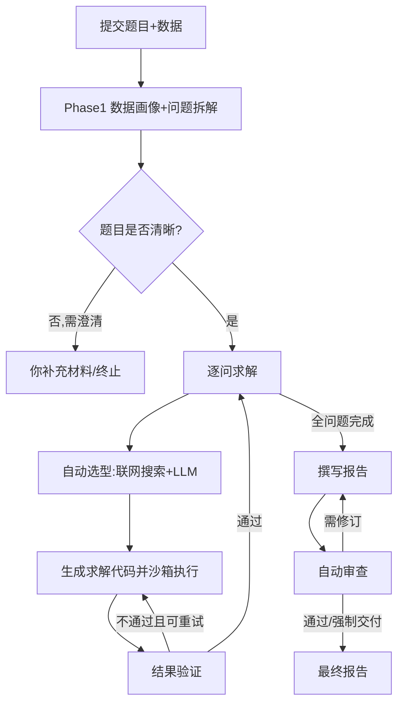
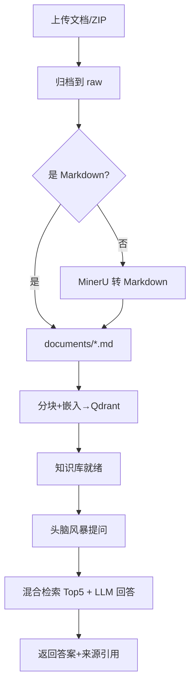

# MMAgent 功能文档

> 版本：V 1.1.0
> 范围：说明**数学建模智能体**与**RAG (头脑风暴)的核心功能。**

## 1. 产品定位

**MMAgent**是一个面向**数学建模任务**的**智能体平台**，平台由两大互相关联的核心功能构成：

1. **建模任务（智能体求解）**：提交任务，系统自动产出完整建模报告；产出报告可以再审查后上传知识库，形成可复用的经验。
2. **头脑风暴（RAG 辅助）**：构建本地知识库，与"读过这些资料的 LLM"对话，帮助梳理建模思路或者直接形成可用的针对问题的模型，形成的最终思路或模型可以直接加载到建模智能体。

---

## 2. 功能一：建模任务（智能体求解）

### 2.1 你能做什么

- 提交一道数学建模题（直接粘贴文本，或上传 `.md`/`.txt` 题目文件）。
- 附加数据文件（CSV/Excel/图片等，可多个）。
- 选择/配置大模型（OpenAI、DeepSeek 或自定义 OpenAI 兼容 endpoint）。
- 在运行中**人工介入**：回答澄清、调整每问预算、取消任务。
- 获取**完整产物**：建模报告（Markdown）、图表、表格、中间代码与数据，以及审查报告。

### 2.2 端到端流程

### 2.3 关键能力亮点

- **自动方法探索**：联网检索相关建模方法 + LLM 思考双路径，避免"拍脑袋选型"；如果启动了头脑风暴功能，构建了知识库，则可选择加载讨论中思路。
- **代码化求解**：LLM 生成 Python 求解代码并在隔离子进程执行，结果可复现。
- **可追溯报告**：报告章节与证据、决策日志、各问结论一一对应，便于人工复核。

### 2.5 产物清单

- `input/`：题目与数据原件
- `questions/`：各子问题的中间产物（代码、数据 CSV、表格 JSON）
- `figures/`：输出的图片
- `paper/`：报告（`paper.md`、`paper.docx` ）
- `review_report.json`：审查报告
- run.log：运行日志

---

## 3. 功能二：基于RAG知识库的头脑风暴

### 3.1 你能做什么

- 上传参考资料（PDF/DOC/DOCX/PPT/PPTX/PNG/JPG/Markdown/TXT，或含上述文件的 ZIP）。
- 将非 Markdown 文档经 **MinerU** 转换为 Markdown（公式、表格可识别）。
- 一键**分块 + 向量化**，建立本地检索索引。
- 在"头脑风暴"对话中与加载了知识库知识的LLM提问，获得**带引用出处**的回答，辅助形成建模思路。

### 3.2 使用流程

### 3.3 检索能力说明

- **混合检索**：稠密（BGE 语义向量）+ 稀疏（BM25 关键词）双路召回，各取 Top 50。
- **RRF 融合**：两路排名融合后取最相关的 Top 5 片段。
- **LLM 压缩**：传入 LLM 时对候选做上下文压缩，去除冗余噪声。
- **引用溯源**：每个回答附带 `source_file`（来源文档）与原文片段，便于核对。

### 3.4 管理操作

- **管理历史记录**：可以查看历史知识文档上传操作记录；可以管理灵感讨论历史对话记录，继续聊天或者删除对话（网页和本地记录同时删除）

---

## 4. 配置条件

1. 需要LLM API、Tavily API([www.tavily.com](https://www.tavily.com/))和Mineru API([mineru.net](https://mineru.net/))
2. 需要在本地下载`bge-small-zh-v1.5`嵌入模型

## 5. 典型使用路径

**路径 A（直接求解）**：提交题目 → 等待/按需澄清 → 查看进度 → 下载报告（Markdown/DOCX）。

**路径 B（思路先行）**：上传参考资料 → 分块嵌入 → 头脑风暴提问打磨思路 → 提交建模任务（在题面/数据里体现思路）→ 获取报告。

**路径 C（迭代改进）**：跑一次任务 → 阅读报告与审查意见 → 在知识库补充文献 → 再次提交，逐步逼近更优解。
