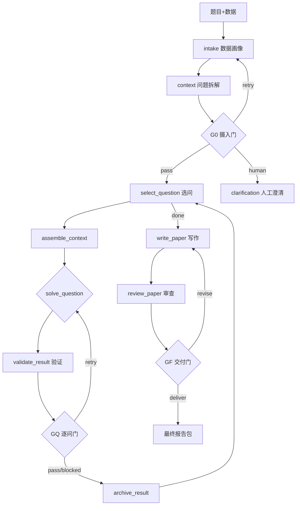

# MMAgent 技术文档

> 版本：V 1.1.0
> 范围：聚焦两大核心功能模块——`scr/`（数学建模智能体）与 `KnowledgeBase/`（本地知识库 RAG），并说明二者通过 `server/` 集成的方式。

---

## 1. 系统概述

MMAgent 是一个面向数学建模任务的**全流程自动化智能体平台**。其设计哲学是 **LLM-only 策略**：不预设固定建模方法论，也不对问题做硬性分类套用固定解法，而是由大语言模型围绕具体问题驱动"理解→拆解→选型→建模→验证→写作"的完整链路。

平台由两大核心功能模块构成：

| 模块           | 目录               | 角色                                   | 何时调用                         |
| -------------- | ------------------ | -------------------------------------- | -------------------------------- |
| 数学建模智能体 | `scr/`           | 端到端任务求解引擎（从题目到建模报告） | 用户提交一道建模题               |
| 本地知识库 RAG | `KnowledgeBase/` | 检索增强的"头脑风暴/灵感讨论"助手      | 用户在知识库中进行问答、形成思路 |

二者通过 `server/` 中的 FastAPI 服务层与 `web/` 前端集成，共享同一套 LLM 配置与文件存储基础设施。

> 注：用户口语中的 "src" 即仓库内的 `scr/` 目录（`pyproject.toml` 注释明确其为"运行时通过 sys.path 引入的命名空间包"）。

---

## 2. 技术栈

| 层次              | 技术选型                                                                          |
| ----------------- | --------------------------------------------------------------------------------- |
| 编排              | LangGraph（`StateGraph` + `MemorySaver` 检查点）                              |
| 大模型接入        | `langchain-openai`（OpenAI 兼容：OpenAI / DeepSeek / 自定义 endpoint）          |
| 结构化数据        | Pydantic v2                                                                       |
| 数值计算 / 可视化 | pandas, numpy, scipy, scikit-learn, matplotlib, pulp                              |
| 文档转换          | MinerU API（PDF/DOC/PPT/图片 → Markdown）                                        |
| 文本切分          | LlamaIndex`SentenceWindowNodeParser`                                            |
| 向量嵌入          | BGE-Small-Zh-V1.5（本地 HuggingFace，CPU 推理）                                   |
| 向量存储          | Qdrant（本地文件型，无需独立服务进程）                                            |
| 检索后处理        | `langchain-classic` `LLMChainFilter` 上下文压缩                               |
| 服务框架          | FastAPI + Uvicorn，SSE（Server-Sent Events）实时进度                              |
| 前端              | React + Vite + TypeScript（react-markdown + remark-math + rehype-katex 渲染公式） |

---

## 3. 核心功能一：数学建模智能体（`scr/`）

### 3.1 架构与状态机

采用 LangGraph 有状态图（stateful graph）驱动，包含 **17 个节点 + 3 道质量门（Gate）**，按 6 个阶段推进：

- **Phase 1 — 摄入与全局上下文**：数据画像 → 问题理解/拆解/分类 → G0 摄入门
- **Phase 2–5 — 逐问求解闭环**：选问 → 组装上下文 → 配置预算 → 求解 → 验证 → GQ 逐问门 → 归档（循环直到全部子问题处理完）
- **Phase 6 — 审查、写作与交付**：配置预算 → 全任务审查 → 写作 → 审查报告 → GF 交付门 → 产出最终包

入口：`scr/math_modeling_agent/main.py`（`init` / `run` 两个子命令）；编排核心：`scr/math_modeling_agent/graph.py` 的 `build_graph()` / `run_graph()`；状态定义：`state.py` 的 `ProjectState`（TypedDict）。

### 3.2 模块划分

| 子包                     | 关键文件                                                                                                                                                                                                                     | 职责                                                                                                      |
| ------------------------ | ---------------------------------------------------------------------------------------------------------------------------------------------------------------------------------------------------------------------------- | --------------------------------------------------------------------------------------------------------- |
| `math_modeling_agent/` | `main.py`, `graph.py`, `state.py`, `llm.py`                                                                                                                                                                          | 编排核心、CLI、状态机、LLM 工厂（`create_llm` 自动探测 `LLM_*`/`OPENAI_*`/`DEEPSEEK_*` 环境变量） |
| `agents/`              | `problem_analyst.py`, `method_explorer.py`, `model_builder.py`, `code_modeler.py`, `question_solver.py`, `result_validator.py`, `paper_writer.py`, `reviewer.py`, `decomposition_fallback.py`, `base.py` | 建模流水线各角色能力（见 3.3）                                                                            |
| `gates/`               | `g0_intake.py`, `gq_question.py`, `gf_delivery.py`                                                                                                                                                                     | 三道确定性质量门，含路由决策                                                                              |
| `workflow/`            | `intake.py`, `project_context.py`, `question_loop.py`                                                                                                                                                                  | 阶段流程节点（数据画像、上下文、选问闭环）                                                                |
| `runtime/`             | `budget.py`, `checkpoint.py`, `instrumented_llm.py`, `logging.py`, `artifacts.py`                                                                                                                                  | 横切基础设施（预算、检查点、埋点、日志、产物）                                                            |
| `schemas/`             | `problem.py`, `context.py`, `formulation.py`, `question.py`, `evidence.py`, `paper.py`, `research.py`, `common.py`                                                                                           | 全部 Pydantic 数据结构                                                                                    |
| `templates/`           | `paper_templates.py`                                                                                                                                                                                                       | 数学建模竞赛统一报告模板（`UNIFIED_TEMPLATE`）                                                          |
| `tools/`               | `code_executor.py`, `file_tools.py`, `tavily_search.py`, `visualization_tools.py`, `table_tools.py`, `md2docx.py`, `llm_response.py`, `matplotlib_config.py`, `result_keys.py`                             | 确定性外部能力（见 3.3）                                                                                  |

### 3.3 关键角色与能力

- **ProblemAnalyst**（`problem_analyst.py`）：问题理解 → 子问题拆解（`decompose`，失败时回退 `decomposition_fallback`）→ 问题分类。
- **MethodExplorer**（`method_explorer.py`）：双路径方法探索——Tavily 联网搜索 + LLM 思考，产出 `decision_record`（选型/预期输出/验证要求）。
- **ModelBuilder**（`model_builder.py`，计算引擎核心）：按题型（`math_task`，如评价/预测/优化/随机/分类/聚类/仿真/机理/复合）分派建模；主路径 `LLM 可用 → _execute_code_based`：`CodeModeler` 生成"模型设计 JSON + 求解代码" → `code_executor` 沙箱执行（子进程隔离，注入 `MODEL_DATA_PATH`/`MODEL_FIGURE_DIR`，拒绝 NaN/Inf）→ 结果校验，失败按 `CODE_REPAIR` 预算反馈重试。
- **CodeModeler**（`code_modeler.py`）：LLM 生成模型设计与 Python 求解代码（默认 600s 超时），要求代码以 `__MODEL_RESULT__` 标记输出结果。
- **QuestionSolver**（`question_solver.py`）：逐问求解的 LangGraph 包装，用 `InstrumentedLLM` 包裹以统计 token/耗时。
- **ResultValidator**（`result_validator.py`，确定性）：按题型校验证据与结果（排名稳定性、回归指标、时间泄漏等），输出 passed/warning/failed。
- **PaperWriter**（`paper_writer.py`，最大模块）：证据驱动撰写，接入 `visualization_tools`、`table_tools`（含 LaTeX 公式生成）、`UNIFIED_TEMPLATE`。
- **Reviewer**（`reviewer.py`，确定性、无 LLM）：覆盖度/一致性/可追溯性/验证/格式检查，决定 passed / needs_revision / failed。

**确定性工具（`tools/`）**：`code_executor`（隔离执行）、`file_tools`（读表 + 数据画像）、`tavily_search`（联网）、`visualization_tools`（14 类学术图）、`table_tools`（表格 + LaTeX）、`md2docx`（Markdown→DOCX，优先 Pandoc）、`llm_response`（鲁棒 JSON/代码解析）。

### 3.4 质量门与预算控制

- **G0 摄入门**：硬失败项为 `problem_text_empty`、问题为空、依赖环、缺失等；路由 `pass/retry/human`（人工澄清可 `terminate` 或补充材料后重跑）。
- **GQ 逐问门**：`STRUCTURAL_CHECK_PREFIXES` 强制 `blocked`（不烧预算）；路由 `pass/retry/blocked`。
- **GF 交付门**：耗尽 `PAPER_REVISION` 预算后强制交付。
- **预算（`runtime/budget.py`）**：`BudgetType`（SEARCH/CANDIDATE/CODE_REPAIR/VALIDATION_ITERATION/INTAKE_RETRY/PAPER_REVISION/TIME/TOKEN），`BudgetManager` 提供 `consume/check/set_question_limits/reset_for_new_question/to_dict`。默认 `VALIDATION_ITERATION=2, INTAKE_RETRY=3, PAPER_REVISION=2, SEARCH=10, CANDIDATE=4, CODE_REPAIR=3`。
- **人机协同点**：G0 澄清回调、`budget_config_callback`（STDIN / 前端弹窗覆盖每问预算）、GF 修订循环、`cancel_run`（节点边界取消）。

### 3.5 关键设计原则

1. **LLM 与确定性分离**：LLM 负责推理/生成，Python 工具负责可复现的计算/验证/绘图/格式化，便于单测。
2. **状态分区**：全局只读上下文 / 当前问题可写状态 / 已完成结果库 / 运行配置 / 终态产物。
3. **三层降级**：联网失败→LLM 思考兜底；代码失败→重试（消耗 CODE_REPAIR）→阻塞；审查失败→耗尽预算强制交付。
4. **可观测**：检查点（`artifacts/_checkpoints/<run_id>/`）、结构化日志（`run.log` JSON）、`InstrumentedLLM` 埋点。

---

## 4. 核心功能二：RAG（`KnowledgeBase/`）

### 4.1 模块

| 文件               | 职责                                                                                                                       |
| ------------------ | -------------------------------------------------------------------------------------------------------------------------- |
| `upload_file.py` | 上传文档（支持ZIP 解包）、MinerU 一键转换、上传清单持久化、删除与 UUID 治理                                                |
| `chunk.py`       | 基于 LlamaIndex的`SentenceWindowNodeParser` 进行句子窗口切分，输出 JSONL 节点（含 `window`和`original_text` 元数据） |
| `embedding.py`   | 加载本地`bge-small-zh-v1.5`嵌入模型，创建本地Qdrant向量库                                                                |
| `main.py`        | 实现混合检索以及注入检索内容的LLM交互聊天                                                                                  |

### 4.2 检索技术（混合检索 + RRF + 压缩）

`retrieve`流程：

1. **稠密召回**：BGE 模型对问题编码 → Qdrant 余弦检索 Top 50。
2. **稀疏召回**：自实现、无三方依赖的 **BM25**，对 Qdrant 已存 payload 重排 Top 50。
3. **融合**：**RRF**，常数 `RRF_K=60`，融合两路排名后取 Top 5。
4. **压缩**：若传入 `llm`，用 `langchain-classic` 的 `LLMChainFilter` 对融合结果做上下文压缩（`COMPRESSION_PREVIEW_LENGTH=8000`）。

### 4.3 模型与存储

- **嵌入模型**：`KnowledgeBase/embedding_model/bge-small-zh-v1.5`，CPU 推理，`normalize_embeddings=True`。
- **向量库**：Qdrant 本地文件（`KnowledgeBase/qdrant_db`），集合名 `knowledge_chunks`，向量维度由模型决定（BGE-small-zh 为 512）。
- **数据隔离**：每个文档分配稳定 UUID（`document_id`），删除时按 `document_id` 过滤并重建索引。
- **安全**：路径解析拒绝目录穿越；上传大小限制（单文件 ≤200MB，压缩包 ≤500MB / 500 文件）。

---

## 5. 集成层（`server/`）与 API

`server/main.py`（FastAPI）同时导入 `KnowledgeBase.*` 与 `scr.*`，是两大功能的统一后端。

### 5.1 建模任务相关 API（`server/runs.py` 支撑）

| 方法 | 路径                                                    | 说明                                                          |
| ---- | ------------------------------------------------------- | ------------------------------------------------------------- |
| POST | `/api/runs`                                           | 提交任务（题目文本/文件 + 数据附件 + LLM 配置），后台异步执行 |
| GET  | `/api/runs`                                           | 任务列表                                                      |
| GET  | `/api/runs/{id}`                                      | 任务详情（进度 + 产物）                                       |
| GET  | `/api/runs/{id}/progress/stream`                      | SSE 实时进度（节点级）                                        |
| POST | `/api/runs/{id}/budget-confirm`                       | 确认每问预算覆盖                                              |
| POST | `/api/runs/{id}/clarification`                        | G0 澄清（terminate / continue + 补充材料）                    |
| POST | `/api/runs/{id}/cancel`                               | 取消任务                                                      |
| GET  | `/api/runs/{id}/paper` `/figures` `/files/{path}` | 获取报告、图表、产物文件                                      |

### 5.2 知识库相关 API

| 方法   | 路径                                    | 说明                              |
| ------ | --------------------------------------- | --------------------------------- |
| GET    | `/api/knowledge/status`               | 知识库能力与文档清单              |
| POST   | `/api/knowledge/documents`            | 上传文档/ZIP                      |
| POST   | `/api/knowledge/documents/convert`    | MinerU 转 Markdown                |
| DELETE | `/api/knowledge/documents`            | 删除文档（同步删向量 + 重建）     |
| POST   | `/api/knowledge/chunk-embed`          | 触发分块 + 嵌入（带进度锁）       |
| GET    | `/api/knowledge/chunk-embed/progress` | 索引进度                          |
| POST   | `/api/knowledge/brainstorm`           | 检索 + LLM 生成回答（含引用溯源） |
| GET    | `/api/knowledge/discussions[/id]`     | 灵感讨论历史                      |

## 6. 前端（`web/`）

React + Vite + TypeScript 单页应用，关键页面：`Home`、`Submit`/`NewTask`（提交）、`ModelingTasks`/`Progress`/`Result`（任务运行与产物）、`KnowledgeBase*` 系列（上传/转换/分块嵌入/统计/历史）、`Brainstorm*` 系列（灵感讨论）、`ApiManager`（LLM 配置）、`Docs`。公式经 `react-markdown` + `remark-math` + `rehype-katex` 渲染。后端若已构建 `web/dist`，`server` 直接静态托管前端。---
