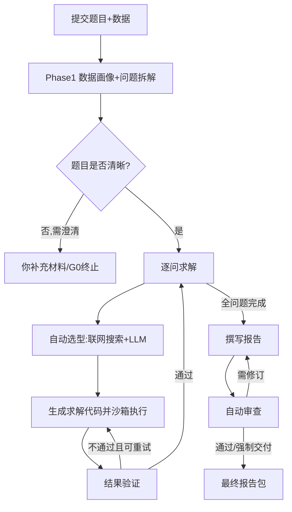
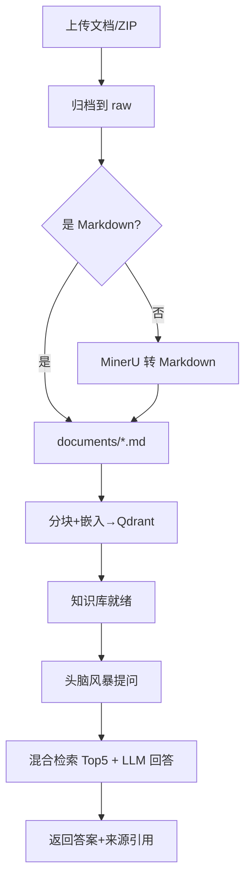

# MMAgent 功能文档

> 版本：V 1.1.0
> 范围：说明平台两大核心功能——**数学建模智能体**与**本地知识库 (头脑风暴 RAG)**——的能力与产物。

---

## 1. 产品定位

MMAgent 是一个面向数学建模任务的**智能体平台**。它把"读懂题目 → 拆解子问题 → 建模 → 跑数据得结果 → 验证 → 写成报告"这一复杂人工流程，自动化为一个可监控、可干预、可复现的系统。

平台提供两大互相关联的功能入口：

1. **建模任务（智能体求解）**：你提交任务（可附数据），系统自动产出完整建模报告。
2. **头脑风暴（RAG 辅助）**：上传参考资料，系统与"读过这些资料的 LLM"对话，帮你梳理建模思路、检验方法。

---

## 2. 功能一：建模任务（智能体求解）

### 2.1 你能做什么

- 提交一道数学建模题（直接粘贴文本，或上传 `.md`/`.txt` 题目文件）。
- 附加数据文件（CSV/Excel/图片等，可多个）。
- 选择/配置大模型（OpenAI、DeepSeek 或自定义 OpenAI 兼容 endpoint）。
- 在运行中**人工介入**：回答澄清、调整每问预算、取消任务。
- 获取**完整产物**：建模报告（Markdown）、图表、表格、中间代码与数据，以及审查报告。

### 2.2 端到端流程

### 2.3 各阶段产出

| 阶段                   | 系统动作                                                                                                                              | 你会看到 / 可干预                                                                                    |
| ---------------------- | ------------------------------------------------------------------------------------------------------------------------------------- | ---------------------------------------------------------------------------------------------------- |
| 摄入（Phase 1）        | 数据画像（字段类型、缺失率、时间/空间维度、相关性、建模约束）；LLM 拆解子问题并构建依赖图                                             | 若题目信息不足，弹出**澄清请求**：你可终止或补充材料                                           |
| 逐问求解（Phase 2–5） | 按依赖顺序选问 → 方法探索（Tavily 联网 + LLM 思考）→ 生成模型设计 JSON + 求解代码 → 隔离沙箱执行（含图表/表格）→ 按题型确定性验证 | 每个问题可弹出**预算确认**（沿用默认或覆盖上限）；代码失败自动重试，多次失败则该问标记 blocked |
| 写作与交付（Phase 6）  | 证据驱动撰写统一格式报告（含 LaTeX 公式）；确定性审查（覆盖度/一致性/可追溯/格式）                                                    | 审查不通过时自动修订直到通过或预算耗尽（耗尽后强制交付）                                             |
| 全程                   | 节点级进度经 SSE 实时推送                                                                                                             | 可随时**取消**任务                                                                             |

### 2.4 关键能力亮点

- **自动方法探索**：联网检索相关建模方法 + LLM 思考双路径，避免"拍脑袋选型"。
- **代码化求解**：LLM 生成 Python 求解代码并在隔离子进程执行（注入数据路径与出图目录，拒绝 NaN/Inf），结果可复现。
- **按题型校验**：评价/预测/优化/随机/分类/聚类/仿真等问题分别有对应的验证规则（如排名稳定性、回归指标、时间泄漏检测）。
- **可追溯报告**：报告章节与证据、决策日志、各问结论一一对应，便于人工复核。

### 2.5 产物清单（位于 `artifacts/<run_id>/`）

- `input/`：题目与数据原件
- `questions/`：各子问题的中间产物（代码、数据 CSV、图表、表格 JSON）
- `evidence/`、`paper/`：证据与报告（`paper.md` 等）
- `review/`：审查报告
- `_checkpoints/`：检查点（支持断点续跑）

---

## 3. 功能二：知识库与头脑风暴（RAG 辅助）

### 3.1 你能做什么

- 上传参考资料（PDF/DOC/DOCX/PPT/PPTX/PNG/JPG/Markdown/TXT，或含上述文件的 ZIP）。
- 将非 Markdown 文档经 **MinerU** 转换为 Markdown（公式、表格可识别）。
- 一键**分块 + 向量化**，建立本地检索索引。
- 在"头脑风暴"对话中向知识库提问，获得**带引用出处**的回答，辅助形成建模思路。
- 查看历史讨论、统计与已索引文档。

### 3.2 使用流程

### 3.3 检索能力说明

- **混合检索**：稠密（BGE 语义向量）+ 稀疏（BM25 关键词）双路召回，各取 Top 50。
- **RRF 融合**：两路排名融合后取最相关的 Top 5 片段。
- **LLM 压缩（可选）**：传入 LLM 时对候选做上下文压缩，去除冗余噪声。
- **引用溯源**：每个回答附带 `source_file`（来源文档）与原文片段，便于你核对。

### 3.4 管理操作

- **删除文档**：同步删除向量并重建索引，保证检索结果一致。
- **统计 / 历史**：查看已索引文档的切片数量、历史头脑风暴讨论。

---

## 4. 两功能的协同关系

- **当前已打通**：知识库通过"头脑风暴"功能为你的建模**前期思路**服务——你先与知识库对话打磨想法，再把它落到"建模任务"中执行。
- **设计中的深度集成**（`KnowledgeBase/architecture_rag.md`）：
  - 将知识库中的建模思路**直接加载进任务智能体**，引导其建模；
  - 将每次任务产出的报告**回灌知识库**，形成"越用越聪明"的闭环。
  - 当前 `scr/` 求解闭环尚未直接调用 `KnowledgeBase.retrieve`，属于规划方向。

---

## 5. 配置与前置条件

| 项目                 | 说明                                                                                                                |
| -------------------- | ------------------------------------------------------------------------------------------------------------------- |
| 大模型               | 配置`LLM_*`/`OPENAI_*`/`DEEPSEEK_*` 环境变量，或在前端"API 管理"中设置（持久化 `server/api_settings.json`） |
| MinerU（知识库转换） | 在 API 管理中配置 MinerU Token（`external_services.mineru`），否则非 Markdown 文档无法转 Markdown                 |
| 知识库索引           | 必须先"上传 → （转换）→ 分块嵌入"，`/api/knowledge/brainstorm` 才能检索                                         |
| 运行环境             | Python ≥ 3.11；前端为 React+Vite（`web/dist` 构建后由后端静态托管）                                              |

---

## 6. 典型操作路径

**路径 A（直接求解）**：提交题目 → 等待/按需澄清 → 查看进度 → 下载报告（Markdown/DOCX）。

**路径 B（思路先行）**：上传参考资料 → 分块嵌入 → 头脑风暴提问打磨思路 → 提交建模任务（在题面/数据里体现思路）→ 获取报告。

**路径 C（迭代改进）**：跑一次任务 → 阅读报告与审查意见 → 在知识库补充文献 → 再次提交，逐步逼近更优解。
